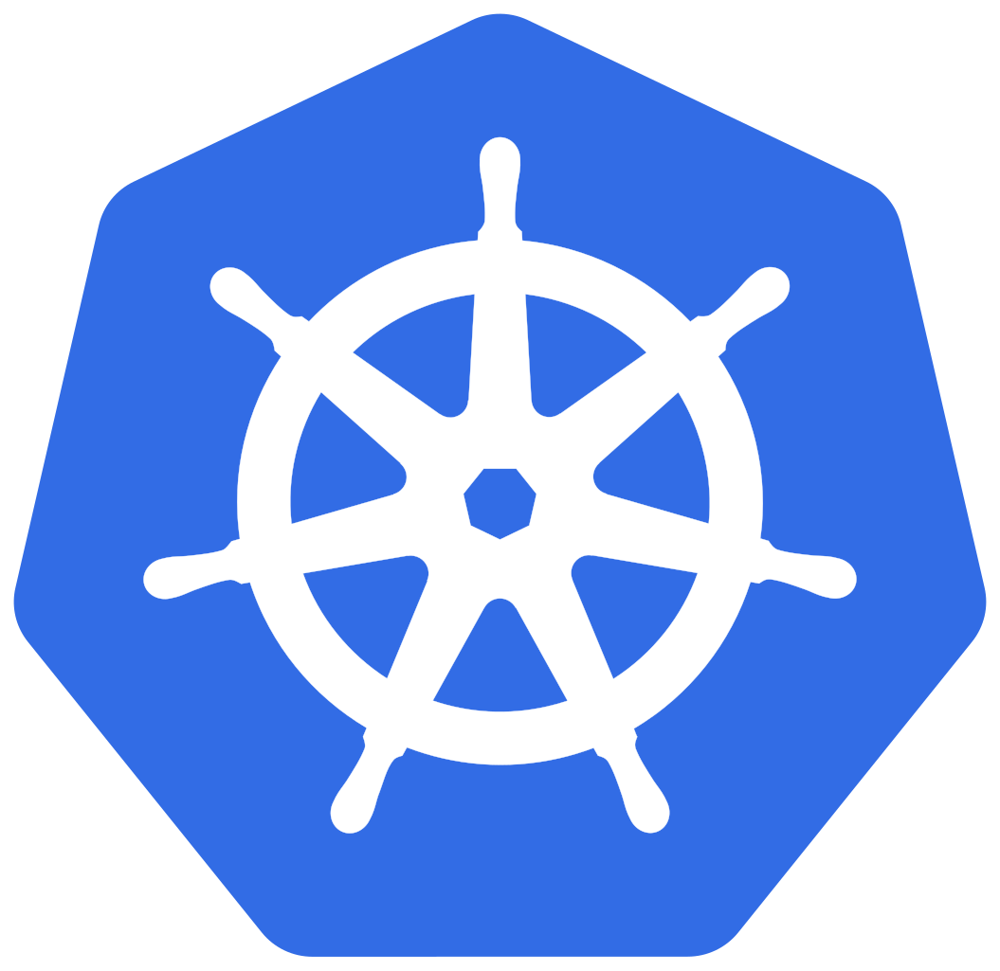

<div class="grid" markdown>

 { width=200px height=200px }

<div markdown>
**Containers as a Service (CaaS)** is Roche's managed container runtime based on Kubernetes (k8s). CaaS offers access to a shared cluster that allows you to run your containerized applications in various on-premise and cloud networks. 

With CaaS you can host even C3/C4 qualified data without having to worry about the underlying infrastructure, cloud accounts and cluster set-up. 
</div>


</div>
  
<div class="grid" markdown>

[![:material-web: CaaS gSite]](https://sites.google.com/roche.com/caas/home){ .md-button .md-button--primary }

[![:material-web: CaaS Wiki]](https://rochewiki.roche.com/confluence/display/CaaS/Caas+Product+Home){ .md-button .md-button--primary }

[![:material-web: CaaS Service Book (Slides)]](https://docs.google.com/presentation/d/19htyI7tii9bSHpvuM1n7Sppow_-XX9wqxK1PDhTMoNA){ .md-button .md-button--primary }

</div>

## Prerequisites

To make sure CaaS is the right platform for you, check out… If CaaS doesn’t meet your requirements, you’ll also find guidance on alternative hosting platforms. [Roche Hosting Platforms overview](../Technical_Recipes_By_Area/Hosting_Platform_Decision/Roche_Platforms_Overview/Platforms_Overview.md).

## Your CaaS Journey

```kroki-mermaid
    flowchart LR
        subgraph l1["Level 1"]
            c1["Create non-prod environment"]
            c2["Deploy a Helm chart"]
            c3["Deploy PostgreSQL"]
            
            c1 --> c2 & c3
        end

         subgraph l2["Level 2"]
            j1["Build and Store Container Images"]
            j2["Use reliability features"]
               
        end

        l1 --> l2
```

To get to know CaaS **Level 1** consists of setting up a non-prod environment and deploying your first helm chart, a PHP-webserver along with a PostgreSQL database. 

In **Level 2** you explore more in depth topics such as building and storing Docker containers at Roche and how to ensure high-availability with Kubernetes. 

### Level 1 - Deploy a Helm chart in a non-prod environment

<div class="grid cards" markdown>

-   :material-kubernetes:{ .lg .middle } __Create a Non-Prod Environment__

    ---

    Request a CaaS enterprise non-prod environment

    **Tools:** Rancher, Kubernetes (k8s)

    **Duration:** 2–3 days (including approval time)

    [:octicons-arrow-right-24: Onboarding Guide](../Technical_Recipes_By_Area/Hosting_Platfrom_Access/Request_CaaS_Project.md)

-   :material-diving-helmet:{ .lg .middle } __Deploy a helm-chart__

    ---

    Deploy a basic webserver to serve PHP and learn how to expose it to the Roche Company Network (RCN) and monitor it. 

     **Tools:** Helm chart, Kubernetes (k8s), Apache, Sysdig

    [:octicons-arrow-right-24: Deploying your Helm chart](../Technical_Recipes_By_Area/Development/CaaS/Helm_Deployment_Guide_CaaS.md)

-   :material-database:{ .lg .middle } __Deploy PostgreSQL__

    ---

    Deploy a basic PostgreSQL container to see how persistent storage works on CaaS.

    **Tools:** GitLab CI, Terraform Cloud

    [:octicons-arrow-right-24: Deploying PostgreSQL Guide](../Technical_Recipes_By_Area/Databases/CaaS/Helm_Postgres_Deployment_Guide_CaaS.md)

</div>

### Level 2 - Advanced Techniques

<div class="grid cards" markdown>

-   :material-docker:{ .lg .middle } __Build and Store Container Images__

    ---

    Containerize your application code to make it ready to run on k8s. 

    **Tools:** GitLab (CI), Kaniko, Artifactory

    [:octicons-arrow-right-24: Image Creation](../Technical_Recipes_By_Area/Images/CaaS/Create_Container_Images.md)

    [:octicons-arrow-right-24: Image Storage Guide](../Technical_Recipes_By_Area/Images/CaaS/Image_Registries.md)

-   :material-shield-crown:{ .lg .middle } __Use reliability features__

    ---

    Learn how to design for high availability on Kubernetes and when/how to use autoscalers (HPA and VPA) 

    **Tools:** Kubernetes

    [:octicons-arrow-right-24: High Availability](../Technical_Recipes_By_Area/Business_Continuity/CaaS/High_Availability_CaaS.md)

    [:octicons-arrow-right-24: Choose your Autoscaling Solution](../Technical_Recipes_By_Area/Business_Continuity/CaaS/Autoscaling_CaaS.md)

</div>
